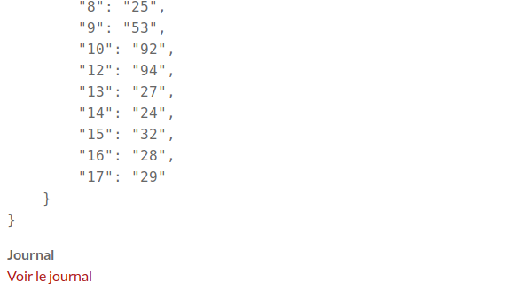

Lorsqu'un utilisateur commence à exécuter un processus qui prend un certain temps, tel qu'une importation d'API, l'avancement du processus est affiché dans l'onglet "Tâches" du tableau de bord de l'administrateur. Le tableau affiche également les travaux terminés, arrêtés et interrompus par une erreur. Le tableau des tâches présente le numéro d'identification du travail, la classe du travail, le statut et le propriétaire, ou l'utilisateur qui a démarré le travail. Vous pouvez classer les lignes du tableau par ID. Classe, Statut ou Propriétaire (décroissant ou croissant) à l’aide des menus déroulants situés juste au-dessus du tableau en haut à droite.

Pour voir les détails d’une tâche, cliquez sur son numéro d’identification. 

Sur la page des détails d’une tâche, vous verrez les informations suivantes:

- *Statut* (En cours, Erreur, Terminé, Arrêté) 
- *Démarré* et *terminé* (horodatages) 
- *Classe* (source de la tâche, par exemple `DspaceConnector\Job\Import`)
- *Propriétaire*
- *Arguments*
- *Journal* - cliquez sur *voir le journal* pour voir le détail des erreurs et messages.

<<<<<<< HEAD

=======

>>>>>>> [FR] Traduction française - fr-v0.1
