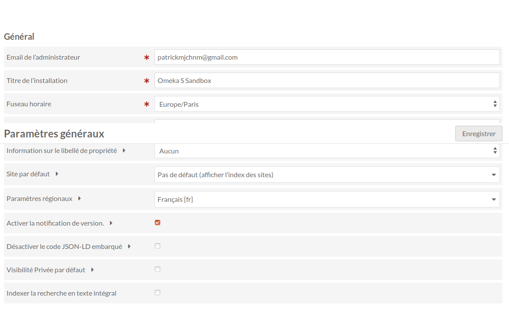
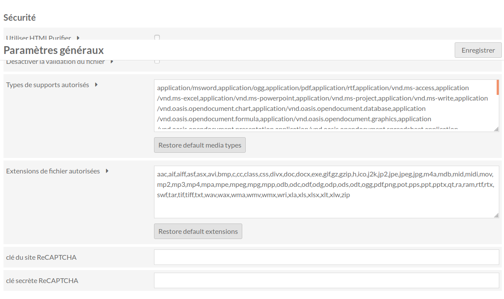

Les administrateurs peuvent modifier les paramètres du tableau de bord de l'administrateur et les paramètres généraux des sites à l'aide de l'onglet *Paramètres* situé à gauche du tableau de bord de l'administrateur (icône représentant une roue dentée).

## Global Settings

Les paramètres globaux ne sont disponibles que pour les utilisateurs dotés des rôles d’administrateur de site ou d’administrateur général.Les paramètres sont divisés en deux sections: Paramètres généraux et Paramètres de sécurité.

### Paramètres généraux

<<<<<<< HEAD

=======
*Email de l'administrateur* définit l'adresse électronique de l'administrateur de l'installation.
Notez que certaines configurations d'hébergement peuvent nécessiter que le nom de domaine de l'e-mail de l'administrateur corresponde au nom de domaine de l'installation (si votre domaine est yourinstall.org, l'adresse e-mail de l'administrateur doit être user@votreinstall.org).
>>>>>>> [FR] Traduction française - fr-v0.1

*Titre de l'installation* vous permet de changer le titre de l'ensemble de l'installation OmekaS. C'est ce qui apparaît dans le coin supérieur gauche du tableau de bord de l'administrateur.

*Fuseau horaire* définit le fuseau horaire par défaut pour l'installation, qui sera utilisé pour les messages de journalisation des erreurs et pour déterminer les dates de création des contenus, des collections et d'autres ressources de l'installation. C'est un menu déroulant.

*Résultats par page* modifie le nombre de résultats (contenus, collections, médias) affichés par page lors de la navigation dans les interfaces publiques ou administrateur de l'installation.

*Information sur le libellé de propriété* détermine ce qui est affiché à côté de chaque propriété lorsque les utilisateurs modifient des contenus et des collections.

* Par défaut, il est défini sur *Aucun*, ce qui signifie que seule l'étiquette de la propriété est affichée.
* Si *afficher le vocabulaire* est sélectionné, l'instruction entre parenthèses à côté du nom de la propriété affiche le vocabulaire utilisé (par exemple, Dublin Core)
* Si *Afficher le terme* est sélectionné, l'instruction entre parenthèses à côté du nom de la propriété affiche le vocabulaire suivant: terme (par exemple, dc: titre).

La liste déroulante *Site par défaut* vous donne le contrôle sur la page d'accueil et l'URL de base de votre installation. Vous pouvez afficher la liste de tous les sites de l'installation (par défaut) ou sélectionner un site spécifique dans la liste déroulante vers laquelle les utilisateurs seront redirigés.

* La liste déroulante *Paramètres régionaux* vous permet de sélectionner dans un menu déroulant les [langues disponibles](https://www.transifex.com/omeka/omeka-s/) pour la langue d'affichage du côté administrateur de votre installation.

*Activer la notification de version* cochez cette case pour activer les notifications pour les nouvelles versions d'Omeka S, les thèmes et les modules.

*Désactiver le code JSON-LD embarqué* Par défaut, Omeka intègre JSON-LD dans la navigation et l'affichage des pages, dans le but d'exposer des métadonnées lisibles par d'autres machines. Cochez cette case pour désactiver l'intégration.

*Visibilité Privée par défaut* Lorsque cette case est cochée, la visibilité de tous les nouveaux éléments, ensembles d'éléments et sites est définie sur Privé. Si cette case n'est pas cochée, la valeur par défaut est publique.

*Indexer la recherche en texte intégral* Cochez cette case pour créer un index des ressources et des sites de votre installation dès que vous cliquez sur Enregistrer. Vous ne devriez avoir besoin d’exécuter ce processus que si vous rencontrez des problèmes de recherche.

### Sécurité

 

<<<<<<< HEAD

=======
- Case à cocher *HTMLPurifier*. Si cette case est cochée, le service [HTMLPurifier] (http://htmlpurifier.org/) nettoiera tout code HTML saisi par l'utilisateur.
- *Désactiver la validation du fichier*: une case à cocher, décochée par défaut. Lorsque cette case est décochée, les téléchargements de fichiers sont limités aux deux champs suivants. Lorsque cette case est cochée, tout type de média ou type MIME peut être téléchargé.
- *Types de média autorisés*: La liste par défaut contient les types de média les plus courants. Seuls les fichiers avec les types de média inclus dans cette liste peuvent être téléchargés vers l'installation.
	- Ajouts à la liste séparés par une virgule
	- Pour revenir aux paramètres par défaut, cliquez sur le bouton *Restaurer les types de média par défaut*
-  *Extensions de fichiers autorisées*: La liste par défaut contient les extensions de fichiers courantes. Seuls les fichiers avec les extensions incluses dans cette liste peuvent être téléchargés vers l’installation.
	- Ajouts à la liste séparés par une virgule
	- Pour revenir aux paramètres par défaut, cliquez sur le bouton *Restaurer les extensions par défaut*
>>>>>>> [FR] Traduction française - fr-v0.1

Les deux derniers champs se rapportent à configurer [reCAPTCHA](https://www.google.com/recaptcha/intro/index.html) pour votre site. Vous aurez besoin d'une clé de site et d'une clé secrète. Entrez-les dans les champs correspondants après votre [inscription](https://www.google.com/recaptcha/admin#list) sur reCAPTCHA/Google:
- *La clé de site reCAPTCHA* permet d'afficher le widget sur les sites de votre installation .
- *La clé secrète reCAPTCHA* permet la communication entre votre installation et le serveur de reCAPTCHA.
